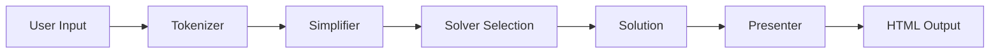
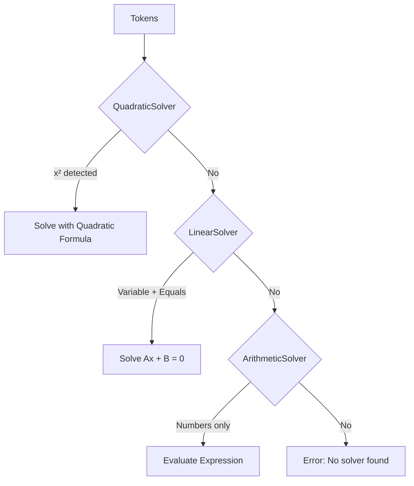

# Olabie Math Solver - Architecture Documentation

This document provides a comprehensive overview of how the Olabie Math Solver works, including the file organization, data flow, and the step-by-step process from user input to solution output.

---

## Table of Contents

1. [Project Overview](#project-overview)
2. [Directory Structure](#directory-structure)
3. [Request Flow: User Input to Solution](#request-flow-user-input-to-solution)
4. [Core Components](#core-components)
   - [Tokenizer](#1-tokenizer)
   - [Parser (Shunting-Yard Algorithm)](#2-parser-shunting-yard-algorithm)
   - [Equation Parser](#3-equation-parser)
   - [Solvers](#4-solvers)
   - [Data Types](#5-data-types)
   - [Presentation Layer](#6-presentation-layer)
5. [Complete Example Walkthrough](#complete-example-walkthrough)
6. [Adding New Features](#adding-new-features)

---

## Project Overview

The Olabie Math Solver is a PHP-based mathematical expression solver built with a custom MVC framework. It takes user input (mathematical expressions in LaTeX or plain text format), parses and tokenizes them, determines the type of problem, solves it using the appropriate solver, and returns a step-by-step solution.



---

## Directory Structure

```
math-solver/
├── app/
│   ├── Controllers/         # HTTP request handlers
│   │   ├── CalculatorController.php
│   │   └── HomeController.php
│   ├── Core/               # MVC framework core
│   │   ├── App.php         # Application bootstrap
│   │   ├── Route.php       # Routing system
│   │   ├── View.php        # View rendering
│   │   └── Helpers.php     # Utility functions
│   └── Services/           # Business logic
│       ├── MathSolverService.php       # Main orchestrator
│       ├── SolutionPresenterService.php # Output formatting
│       └── Math/                        # Math engine
│           ├── Tokenizer.php           # Input tokenization
│           ├── Token.php               # Token data structure
│           ├── Parser.php              # Shunting-yard parser
│           ├── EquationParser.php      # Equation LHS/RHS splitter
│           ├── SimplifierService.php   # Expression simplification
│           ├── Complex.php             # Complex number operations
│           ├── Polynomial.php          # Polynomial operations
│           ├── Solvers/                # Problem solvers
│           │   ├── SolverInterface.php
│           │   ├── ArithmeticSolver.php
│           │   ├── LinearSolver.php
│           │   ├── QuadraticSolver.php
│           │   ├── ExpressionSimplifierSolver.php
│           │   └── IntegralSolver.php
│           └── Presenters/             # Solution formatters
│               ├── SolutionPresenterInterface.php
│               ├── ArithmeticPresenter.php
│               ├── LinearPresenter.php
│               ├── QuadraticPresenter.php
│               └── ErrorPresenter.php
├── public/                 # Web root
│   └── index.php           # Entry point
├── routes/
│   └── web.php             # Route definitions
├── views/                  # HTML templates
│   ├── calculator.html.php
│   ├── home.html.php
│   ├── layouts/
│   └── partials/
└── resources/              # Frontend assets
```

---

## Request Flow: User Input to Solution

When a user submits a mathematical expression, here's exactly what happens:

### Step 1: HTTP Request Handling

```
POST /calculator  →  CalculatorController::solve()
```

The `CalculatorController` receives the user's LaTeX expression from the form:

```php
// CalculatorController.php
public function solve()
{
    $latex = $_POST['latex'] ?? '';
    
    $mathSolver = new MathSolverService();
    $solutionData = $mathSolver->solve($latex);
    
    $presenter = new SolutionPresenterService();
    $solutionHtml = $presenter->render($solutionData);
    
    return view("calculator", [
        'solution' => $solutionData,
        'solutionHtml' => $solutionHtml
    ]);
}
```

### Step 2: The MathSolverService Orchestration

The `MathSolverService` coordinates the entire solving process:

```php
// MathSolverService.php
public function solve(string $expression): array
{
    // 1. Tokenize the input
    $originalTokens = $this->tokenizer->tokenize($expression);
    
    // 2. Simplify tokens (combine like terms, etc.)
    $simplifiedTokens = $this->simplifier->simplify($originalTokens);
    
    // 3. Find the right solver (Chain of Responsibility pattern)
    foreach ($this->solvers as $solver) {
        if ($solver->canSolve($simplifiedTokens)) {
            return $solver->solve($simplifiedTokens, $expression);
        }
    }
}
```

---

## Core Components

### 1. Tokenizer

**File:** `app/Services/Math/Tokenizer.php`

The Tokenizer converts a raw expression string into an array of `Token` objects. This is the first step in understanding user input.

#### What It Does:

1. **Normalizes LaTeX** - Converts LaTeX commands to plain math symbols
2. **Identifies tokens** - Numbers, variables, operators, functions, parentheses
3. **Inserts implicit multiplication** - Handles cases like `2x` → `2 * x`

#### Token Types (defined in `Token.php`):

| Type | Constant | Examples |
|------|----------|----------|
| Number | `T_NUMBER` | `5`, `3.14`, `100` |
| Variable | `T_VARIABLE` | `x`, `y`, `z` |
| Constant | `T_CONSTANT` | `pi`, `e`, `i` |
| Operator | `T_OPERATOR` | `+`, `-`, `*`, `/`, `^` |
| Function | `T_FUNCTION` | `sin`, `cos`, `log`, `sqrt` |
| Left Paren | `T_LPAREN` | `(` |
| Right Paren | `T_RPAREN` | `)` |
| Equals | `T_EQUALS` | `=` |
| Comma | `T_COMMA` | `,` |

#### Example: Tokenizing `\frac{2x}{3} + 5 = 0`

```
Input: "\frac{2x}{3} + 5 = 0"

Step 1 - Normalize LaTeX:
  \frac{2x}{3}  →  (2*x)/(3)
  Result: "(2*x)/(3)+5=0"

Step 2 - Tokenize:
  [LPAREN, NUMBER(2), OPERATOR(*), VARIABLE(x), RPAREN, 
   OPERATOR(/), LPAREN, NUMBER(3), RPAREN, OPERATOR(+), 
   NUMBER(5), EQUALS, NUMBER(0)]

Step 3 - Insert implicit multiplication:
  (Already handled in normalization for this case)
```

---

### 2. Parser (Shunting-Yard Algorithm)

**File:** `app/Services/Math/Parser.php`

The Parser converts an array of tokens from **infix notation** (normal math: `2 + 3`) to **Reverse Polish Notation (RPN)** using the Shunting-yard algorithm.

#### Why RPN?

RPN is easier for computers to evaluate because it eliminates the need for parentheses and operator precedence rules during evaluation.

| Infix | RPN |
|-------|-----|
| `2 + 3` | `2 3 +` |
| `2 + 3 * 4` | `2 3 4 * +` |
| `(2 + 3) * 4` | `2 3 + 4 *` |

#### Operator Precedence:

| Operator | Precedence | Associativity |
|----------|------------|---------------|
| `=` | 0 | Right |
| `+`, `-` | 1 | Left |
| `*`, `/` | 2 | Left |
| `neg`, `pos` (unary) | 3 | Right |
| `^` | 4 | Right |

#### How It Works:

```
Input tokens: [2, +, 3, *, 4]

Process:
1. Push 2 to output: output=[2], stack=[]
2. Push + to stack: output=[2], stack=[+]
3. Push 3 to output: output=[2,3], stack=[+]
4. * has higher precedence than +, push to stack: output=[2,3], stack=[+,*]
5. Push 4 to output: output=[2,3,4], stack=[+,*]
6. Pop remaining operators: output=[2,3,4,*,+]

Result: [2, 3, 4, *, +]
```

---

### 3. Equation Parser

**File:** `app/Services/Math/EquationParser.php`

For equations (expressions with `=`), this parser splits the tokens into Left-Hand Side (LHS) and Right-Hand Side (RHS), then parses each side separately.

```php
// For "2x + 5 = 10"
$result = [
    'lhs' => [2, x, *, 5, +],  // RPN for "2x + 5"
    'rhs' => [10]              // RPN for "10"
];
```

---

### 4. Solvers

**Directory:** `app/Services/Math/Solvers/`

Each solver implements `SolverInterface`:

```php
interface SolverInterface
{
    public function canSolve(array $tokens): bool;
    public function solve(array $tokens, string $originalExpression): array;
}
```

#### Solver Chain (in order of priority):



#### A. ArithmeticSolver

**Handles:** Pure numerical expressions without variables

**Detection:**
```php
public function canSolve(array $tokens): bool
{
    foreach ($tokens as $token) {
        if ($token->type === Token::T_VARIABLE || 
            $token->type === Token::T_EQUALS) {
            return false;
        }
    }
    return true;
}
```

**Process:**
1. Parse tokens to RPN
2. Evaluate RPN using a stack-based algorithm
3. Support complex numbers for all operations

**Example:** `sqrt(16) + 2^3`
```
RPN: [16, sqrt, 2, 3, ^, +]
Stack evaluation:
  - Push 16 → [16]
  - Apply sqrt → [4]
  - Push 2 → [4, 2]
  - Push 3 → [4, 2, 3]
  - Apply ^ → [4, 8]
  - Apply + → [12]
Result: 12
```

#### B. LinearSolver

**Handles:** Equations of form `ax + b = c`

**Detection:**
```php
public function canSolve(array $tokens): bool
{
    $hasVariable = false;
    $hasEquals = false;
    foreach ($tokens as $token) {
        if ($token->type === Token::T_VARIABLE) $hasVariable = true;
        if ($token->type === Token::T_EQUALS) $hasEquals = true;
    }
    return $hasVariable && $hasEquals;
}
```

**Process:**
1. Parse equation into Polynomial objects for LHS and RHS
2. Rearrange: `lhsPoly - rhsPoly = 0`
3. Extract coefficients: `ax + b = 0`
4. Solve: `x = -b/a`

#### C. QuadraticSolver

**Handles:** Equations of form `ax² + bx + c = 0`

**Detection:** Checks for `^2` pattern after a variable

**Process:**
1. Convert to Polynomial form
2. Extract coefficients a, b, c
3. Calculate discriminant: `Δ = b² - 4ac`
4. Apply quadratic formula: `x = (-b ± √Δ) / 2a`
5. Handle all cases (real, complex, single root)

---

### 5. Data Types

#### Complex Numbers (`Complex.php`)

Stores numbers as `real + imaginary*i` and provides:

| Method | Description |
|--------|-------------|
| `add()`, `subtract()` | Basic arithmetic |
| `multiply()`, `divide()` | Complex multiplication/division |
| `pow()` | Exponentiation (handles complex exponents) |
| `sqrt()` | Square root (returns complex for negatives) |
| `sin()`, `cos()`, `tan()` | Trigonometric functions |
| `log()`, `exp()` | Logarithm and exponential |

#### Polynomials (`Polynomial.php`)

Stores polynomials as a map of `power → coefficient`:

```php
// Represents: 3x² + 2x + 5
$poly = new Polynomial([
    2 => new Complex(3),   // 3x²
    1 => new Complex(2),   // 2x
    0 => new Complex(5)    // 5
]);
```

**Operations:** `add()`, `subtract()`, `multiply()`, `divide()`, `pow()`

---

### 6. Presentation Layer

**Directory:** `app/Services/Math/Presenters/`

The presentation layer formats solutions into HTML using the Strategy pattern:

```php
// SolutionPresenterService.php
foreach ($this->presenters as $presenter) {
    if ($presenter->canPresent($solution)) {
        return $presenter->present($solution);
    }
}
```

Each presenter generates HTML with step-by-step explanations and supports MathLive's `<math-field>` elements for LaTeX rendering.

---

## Complete Example Walkthrough

Let's trace through solving `x^2 - 5x + 6 = 0`:

### Step 1: User submits form
```
POST /calculator
Body: latex=x^2-5x+6=0
```

### Step 2: Tokenization
```
Input: "x^2-5x+6=0"
Output tokens:
[VARIABLE(x), OPERATOR(^), NUMBER(2), OPERATOR(-), NUMBER(5), 
 OPERATOR(*), VARIABLE(x), OPERATOR(+), NUMBER(6), EQUALS, NUMBER(0)]
```

### Step 3: Solver Selection
- QuadraticSolver.canSolve() → **true** (has variable, equals, and `^2`)

### Step 4: Polynomial Construction
```
LHS: x² - 5x + 6
RHS: 0

Polynomial: {
    2: Complex(1),   // x² coefficient
    1: Complex(-5),  // x coefficient  
    0: Complex(6)    // constant
}
```

### Step 5: Quadratic Formula Application
```
a = 1, b = -5, c = 6

Discriminant = (-5)² - 4(1)(6) = 25 - 24 = 1

√1 = 1

x₁ = (5 + 1) / 2 = 3
x₂ = (5 - 1) / 2 = 2
```

### Step 6: Result Structure
```php
[
    'type' => 'quadratic_equation',
    'expression' => 'x^2-5x+6=0',
    'variable' => 'x',
    'solutions' => ['3', '2'],
    'steps' => [
        'Start with the original equation...',
        'Rearrange into standard form...',
        'Identify coefficients: a=1, b=-5, c=6',
        'Use the Quadratic Formula: x = (-b ± √(b²-4ac)) / 2a',
        'Calculate discriminant: Δ = 1',
        'Since Δ > 0, there are two real roots',
        'x₁ = 3, x₂ = 2'
    ]
]
```

### Step 7: HTML Presentation
The `QuadraticPresenter` formats this into beautiful HTML with LaTeX rendering.

---

## Adding New Features

### Adding a New Solver

1. Create `app/Services/Math/Solvers/NewSolver.php`:
```php
class NewSolver implements SolverInterface
{
    public function canSolve(array $tokens): bool
    {
        // Detection logic
    }
    
    public function solve(array $tokens, string $originalExpression): array
    {
        // Solving logic
        return ['type' => 'new_type', 'result' => $result, 'steps' => $steps];
    }
}
```

2. Register in `MathSolverService`:
```php
$this->solvers = [
    new NewSolver(),  // Add before lower-priority solvers
    new QuadraticSolver($equationParser),
    // ...
];
```

3. Create corresponding presenter in `Presenters/`.

### Adding a New Function (e.g., `tan`)

1. **Tokenizer**: Already handles `tan` in the pattern
2. **ArithmeticSolver**: Add to `FUNCTION_ARITY` and `applyFunction()`
3. **Complex**: Add the `tan()` method (already exists!)

---

## Design Patterns Used

| Pattern | Where Used | Purpose |
|---------|-----------|---------|
| **MVC** | `Controllers/`, `Services/`, `views/` | Separation of concerns |
| **Chain of Responsibility** | `MathSolverService` | Solver selection |
| **Strategy** | `SolutionPresenterService` | Flexible output formatting |
| **Value Object** | `Token`, `Complex`, `Polynomial` | Immutable data containers |

---

## Summary

The Olabie Math Solver follows a clean, modular architecture:

1. **Input** → Tokenizer normalizes and breaks down the expression
2. **Parsing** → Shunting-yard algorithm converts to RPN
3. **Solving** → Chain of solvers finds the right approach
4. **Computation** → Complex and Polynomial classes handle the math
5. **Output** → Presenters format the solution for display

This architecture makes it easy to add new mathematical capabilities while keeping the codebase organized and maintainable.
